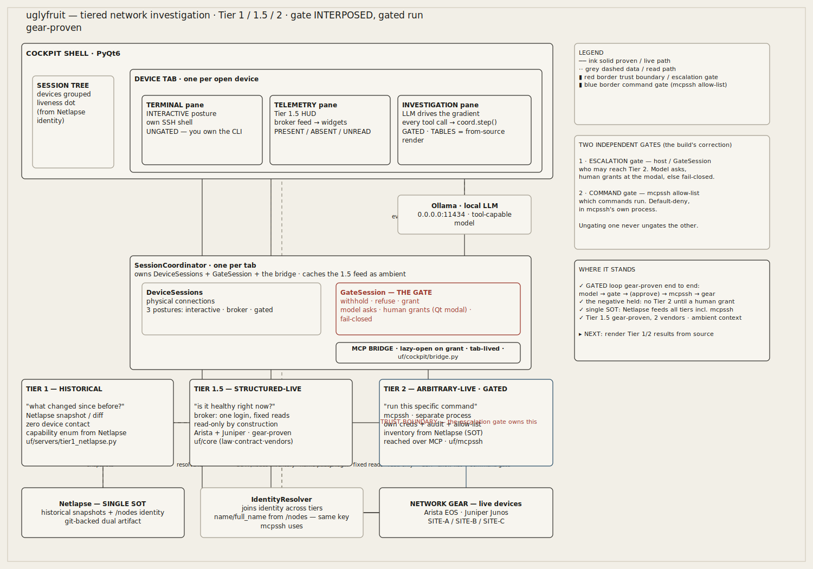
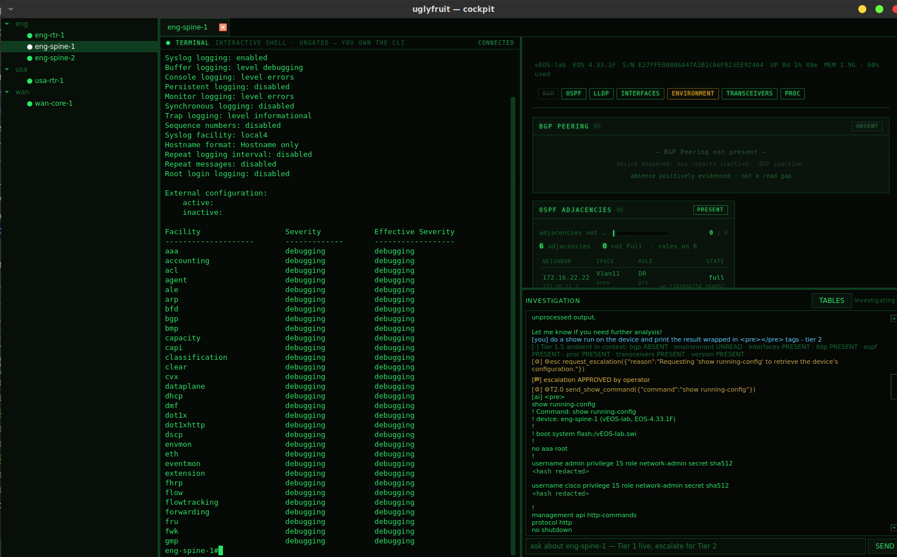
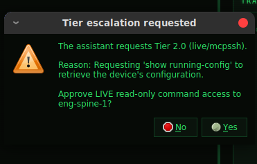
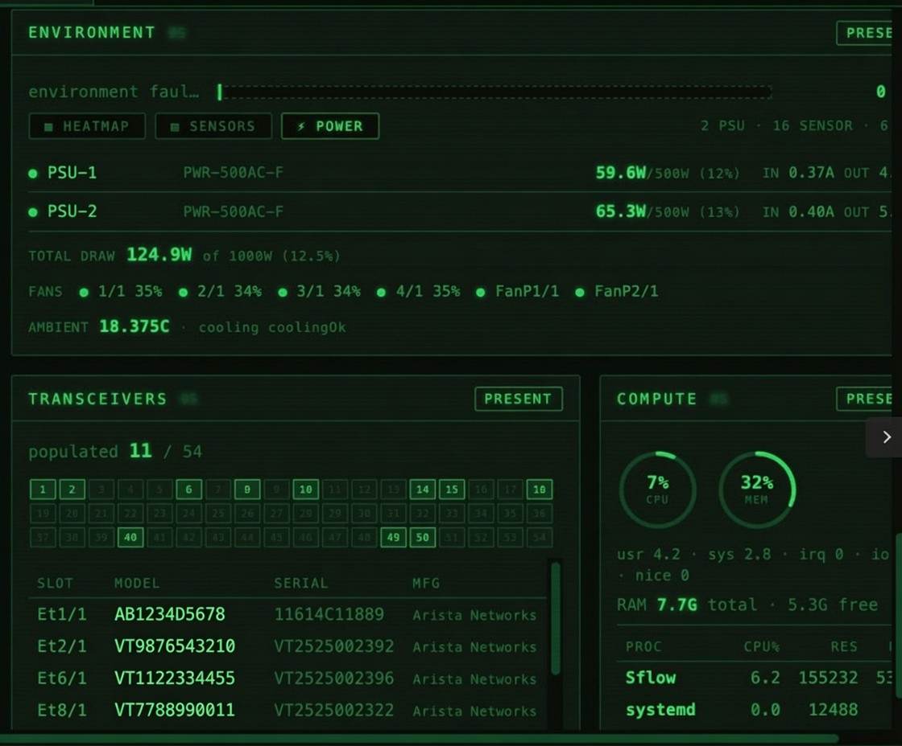

# uglyfruit — the tiered network investigation system

A reference implementation of tiered retrieval for AI-assisted network investigation.
Device state is reached through three tiers — **historical**, **structured-live**, and
**arbitrary-live** — behind one escalation loop where the tier boundary *is* a trust
boundary.



<sub>The whole gradient on one page: cockpit shell → per-tab coordinator → the gate → three tiers, with Netlapse as the single source of truth. Green is proven/live; the red border is the trust boundary; the green border is mcpssh's command allow-list.</sub>


---

## What this is

An AI assistant investigating a production network needs one thing above all: an
accurate picture of device state. The naive way to get it — let the model SSH in and
run commands — is at once the most expensive, the least safe, and the slowest path to
that picture. The opposite extreme — answer only from stored snapshots — is cheap and
safe but blind to the present moment.

uglyfruit is the answer between them: a **gradient of retrieval tiers** where an
investigation escalates only as far as the question actually requires, and where
crossing into live, model-directed command execution is an **explicit, enforced trust
boundary**, not a default the model can drift across. Most questions resolve on the
cheap, safe side; the ones that don't arrive at the top already narrowed by the tiers
below — and only after a boundary was crossed on purpose, by a human.

It is a **reference implementation**, not a single tool. The determination engine that
reads live device health is one component of it; the repository is the whole tiered
system — the three tiers, the host policy that relates them, and the cockpit that
drives the loop.

The **purpose** is a reference architecture; the **use case** is incident response. In
practice, uglyfruit is a focused IR cockpit — the shape of an nhd session, now with a
**local** AI investigator in the pane. The engineer working a live box keeps direct,
**ungated** CLI access — you own the terminal — while the model works the tiered
gradient beside you, gated only at the trust boundary. It **augments** the operator; it
does not stand in for one. The human's reach is never fenced; the model's reach is
exactly the policy's tool set — two command surfaces in one pane, governed by
different rules.

---

## The tiers

Each tier answers a different question, at a different cost, with a different level of
device contact and trust. An investigation walks *down* this list and stops at the
first tier that answers.

| Tier | The question it answers | Device contact | Trust posture |
|---|---|---|---|
| **1 — Historical** | "What did it look like before — what changed?" | none (stored snapshots) | read-only, no contact |
| **1.5 — Structured-live** | "What is this device's health *right now*?" | one login, fixed reads | read-only **by construction** |
| **2 — Arbitrary-live** | "Run this specific command to dig into the anomaly." | model-directed commands | **gated**: escalation + allow-list + audit |

- **Tier 1** answers from history with zero device contact — cheap and safe, often
  enough on its own. The model is told the exact capability vocabulary Netlapse
  captures (bgp, ospf, lldp, interfaces, routes, arp, mac, config), discovered live
  from `/api/v1/search/capture_types`, so it *calls* to find out rather than guessing.
- **Tier 1.5 is the missing middle.** It answers bounded health questions live ("is it
  hot? are its optics clean? are its neighbors up?") with a *fixed* query surface and
  pre-digested, self-referencing output — so the model never chooses a command and
  never parses raw text to learn a box is healthy. Every reading is **present / absent
  / unread** — a device that answers "I have none of this" is never confused with one
  that didn't answer. In the cockpit, the 1.5 feed is injected into the investigation
  as **ambient context**: read-only, below the boundary, so the model reads live health
  without a tool call and never escalates to re-fetch what it already holds.
- **Tier 2** is arbitrary-but-gated live diagnostics — reached only on escalation, and
  only for the question the cheaper tiers already narrowed.

Between Tier 1.5 and Tier 2 sits **the gate** — the host policy that owns the trust
boundary. It withholds Tier 2's tools until an escalation is *requested by the model
and granted by a human*, keeps each tier in a separate process with its own
credentials and audit, and makes every tier transition a logged event. Tiering is what
keeps most questions cheap; the gate is what makes reaching live command execution a
deliberate act.

---

## Where it stands today

**The gate is interposed and the whole gradient runs, gated, on real gear.** In a
single live investigation: the model was shown only the floor tier; asked for
real-time LLDP neighbors; called `request_escalation`; a human approved at the Qt
modal; the host then advertised Tier 2; the model called `send_show_command`; mcpssh
resolved the device against Netlapse, authenticated, ran the command on live Arista
gear, and returned output. The model could not reach SSH until the human said yes, and
the whole sequence is one audit trail — the vision's "un-shown claim and point of
maximum skepticism," now shown.



<sub>The gated loop end to end on lab gear (`eng-spine-1`, vEOS-lab). Left: the ungated terminal you own. Right: the Tier 1.5 HUD as ambient context (BGP **ABSENT** — positively evidenced, not a read gap) and the investigation pane, where the model requested Tier 2, a human approved, and the live command returned real output. This run shows `show running-config`; the terminal panes are yours, the investigation pane is the gate's. (Credential hashes in the returned config are redacted in this screenshot.)</sub>



<sub>The escalation gate made physical: the model asks for Tier 2 with a stated reason, and until a human clicks **Yes**, `send_show_command` is never advertised. No approver → fail-closed.</sub>

| Component | Role | Lives in | Built | Proven | Through the gate |
|---|---|---|---|---|---|
| **Tier 1** | historical snapshot / diff | `uf/servers/tier1_netlapse.py` · `uf/host/identity.py` | ✓ | ✓ shakeout vs live Netlapse | ✓ floor tier |
| **Tier 1.5** | structured-live determination | `uf/core/` (law · contract · vendors) | ✓ | ✓ gear-proven, **2 vendors** | ✓ ambient context |
| **Tier 2** | arbitrary-live, gated | `uf/mcpssh/` *(separate process)* | ✓ | ✓ **gated run gear-proven** | ✓ escalation-gated |
| **The bridge** | tab-lived MCP transport to mcpssh | `uf/cockpit/bridge.py` | ✓ | ✓ lazy-open on grant, gear-proven | ✓ coordinator-owned |
| **The gate** | escalation policy, trust boundary | `uf/host/routing.py` | ✓ | ✓ self-test **+ gated run on gear** | ✓ the chokepoint |
| **Coordinator** | per-tab wiring; ambient + step() | `uf/cockpit/coordinator.py` | ✓ | ✓ gear-proven | ✓ owns both objects |
| **Investigation loop** | model drives the gradient in the cockpit | `uf/cockpit/panes/investigation.py` | ✓ | ✓ gear-proven, **GATED** | ✓ dispatches via `coord.step` |

Legend: **✓** done. The dispatcher swap the prior README named as the remaining work —
`session.call_tool` → `coord.step()` — has landed; the pane now routes every tool call
through the single chokepoint, and the transcript surface is unchanged, exactly as
predicted.

---

## What each component actually is

**Tier 1.5 — the determination engine (`uf/core`).** A three-state law
(PRESENT / ABSENT / UNREAD) where a frame — the health envelope — is constructible
only on PRESENT, so a green panel cannot be fabricated. Two vendors are gear-proven:
**Arista** (bgp/ospf/lldp/mlag/routes/interfaces/version/environment; proc +
transceivers) and **Juniper** (live on an MX10003). A cross-vendor payload contract
(`contract.py`) governs the flat caps so the widget layer is vendor-blind. In the
cockpit the same feed paints the HUD widgets *and* is cached by the coordinator and
rendered into the investigation as ambient context — the HUD and the model read the
same poll, so they cannot disagree about health.



<sub>The 1.5 feed painting the HUD: PSU draw, fans, ambient, per-lane optics (populated 11 / 54), and compute — every number the gear's own, rendered from source. A panel is constructible only on PRESENT, so a green cell can't be fabricated.</sub>

**Tier 1 — the historical tools (`uf/servers/tier1_netlapse.py`, `uf/host/identity.py`).**
`historical_snapshot`, `historical_diff`, `historical_inventory` wrap a live Netlapse
into agent tools. The tools now advertise the capture vocabulary as a JSON-Schema enum,
discovered live from Netlapse — so the model knows `lldp` is a legal capability and
calls for it rather than reasoning it unavailable. It carries the determination law *up
a tier*: a capability Tier 1 never captured returns `available=False` with a reason —
the historical analog of UNREAD, never a fabricated green.

**The gate — the routing policy (`uf/host/routing.py`).** A standalone library that
knows nothing about Netlapse, mcpssh, or any UI. It enforces the escalation boundary
in three places: tools of un-granted tiers are **withheld** from what the model sees,
a fabricated call to one is **refused** before dispatch, and `request_escalation`
does not grant — it **asks**, and a human approver grants (no approver → fail-closed).
In the cockpit that approver is the **Qt approval modal**; the human owns the grant.

**The bridge — the Tier-2 transport (`uf/cockpit/bridge.py`).** The coordinator owns a
sync-faced MCP client to the external mcpssh process, opened **lazily at the first
grant** and held for the tab. Nothing contacts mcpssh until a human has approved once;
the MCP handshake is paid once, not per grant. It runs its own asyncio loop, so a
gated tool call reaches mcpssh across a thread boundary without stalling the model loop
or the GUI. mcpssh stays a separate process, reached across a boundary, never imported —
running it on the same host is a packaging choice and grants it nothing.

**The deterministic renderer (`uf/cockpit/formatting.py`).** The renderer of record for
structured data in the transcript. It turns the real feed into HTML tables in-process —
the numbers are the gear's, not a model's transcription of them. A model retyping a
sensor list can truncate or comma-mangle it and render just as convincingly; this path
cannot, because it never leaves the source dict. The model narrates and reasons; the
cockpit renders facts. (Wired to ambient/health today; extending it to Tier 1 and Tier
2 tool results is the next step.)

**Tier 2 — mcpssh.** A FastMCP server: eight tools, a server-side default-deny
allow-list (deny-precedence, pipe/injection blocking), structured audit with
correlation IDs, bearer-token auth, and tfsm-fire structured parsing. It runs as its
own process with its own credentials and its own audit trail — the trust boundary made
physical. **Its inventory now reads from Netlapse** (see below), not a topology file.

---

## The single source of truth (this build's correction)

The prior plan had two inventories: Netlapse for Tiers 1/1.5, and mcpssh's inherited
Secure Cartography **topology file** for Tier 2. Two inventories meant two truths — and
that is exactly why a name the cockpit knew (`eng-spine-1`) could be *unknown to
mcpssh's topology*, failing the first real gated command with `not found in topology`.

The fix is not a name-mapping shim — it is one source of truth. **mcpssh now builds its
inventory from Netlapse** (`uf/mcpssh/netlapse_inventory.py`), reading the same `/nodes`
list the `IdentityResolver` uses, deriving the device key with the *same* `name` /
`full_name` logic. So the name the gate binds is a valid mcpssh key by construction; the
mismatch is gone structurally, not patched. The topology-file path remains for anyone
running mcpssh standalone — it is a fallback, selected only when no Netlapse URL is set.

One honest trade: Netlapse `/nodes` is a device list, not a topology graph, so
`list_neighbors` (Secure Cartography's adjacency edges) is empty under the Netlapse
source. The connect/command path does not need it; if the graph is wanted back, it is
reconstructable from Netlapse's own LLDP captures rather than by reintroducing the
second SOT.

---

## The trust boundary — two independent gates

"Gated" is two gates at two layers, and neither implies the other:

1. **The escalation gate** (host — `GateSession`). Who may reach Tier 2. The model
   asks, a human grants at the modal, else fail-closed. This is what withholds the
   `send_show_command` tool until approval.
2. **The command gate** (mcpssh — the allow-list). Which commands run. Default-deny in
   mcpssh's own process, across the boundary (`show *` allowed, `show tech-support *`
   and `show running-config all` denied, per `commands.yml`).

Ungating one never ungates the other. The human authorizes the door; the allow-list
shapes the room.

---

## Prerequisites

This is not a standalone tool. It reads from services you must already be running.

- **A reachable Netlapse instance** — the source of truth and historical store. Tiers 1
  and 1.5 have nothing to answer from without it, and mcpssh derives its inventory from
  it.
- **The `netlapse` Python package**, installed and importable. `uf/mcpssh/tfsm_parser`
  imports `netlapse.parser.tfsm_fire` directly for structured parsing.
- **A local Ollama** serving a **tool-capable** model (see step 4 below).
- **Reachable network gear.** Arista and Juniper are the gear-proven vendors.

Python dependencies:

```bash
pip install -r requirements.txt
```

The cockpit is PyQt6; mcpssh is FastMCP over uvicorn/starlette; parsing is TextFSM;
transport is paramiko and httpx.

---

## Running it

Three processes, and — because this is typically run split-box over a VPN — three TLS
surfaces, each with its own verify-off switch. Everything is `http://` on a single box;
the switches matter the day a hop becomes `https://` behind an internal CA. (A fourth
hop — the cockpit to its local Ollama, step 4 — is plain HTTP over a trusted LAN and
carries no verify switch by design: it isn't a TLS surface.)

**1. Netlapse** — the SOT and historical store (see Prerequisites).

**2. mcpssh** — the Tier-2 server, reading Netlapse for inventory:

```bash
export MCPSSH_NETLAPSE_URL="http://<netlapse-reachable-from-this-host>:8888"
export MCPSSH_NETLAPSE_TOKEN="<netlapse-api-token>"   # SOT hop auth
export MCPSSH_NETLAPSE_VERIFY_TLS=false               # verify-off for the Netlapse hop (inert on http)
export MCPSSH_COMMAND_FILE=./commands.yml             # the allow-list (default-deny)

export MCPSSH_TRANSPORT=streamable-http               # serve HTTP (not stdio) — the cockpit connects here
export MCPSSH_HTTP_HOST=127.0.0.1
export MCPSSH_HTTP_PORT=8000
export MCPSSH_HTTP_PATH=/mcp
export MCPSSH_HTTP_AUTH_ENABLED=false                 # lab: match the cockpit (or set a bearer on both sides)

# default device credential — global scope, key auth (no vault needed):
export MCPSSH_USERNAME="<ssh-user>"
export MCPSSH_KEY_FILE="~/.ssh/id_rsa"                # expanduser'd; leave MCPSSH_PASSWORD unset for pure key auth

python -m uf.mcpssh
```

`MCPSSH_TOPOLOGY_FILE` is no longer required once `MCPSSH_NETLAPSE_URL` is set — Netlapse
is the source. Two distinct tokens: `MCPSSH_NETLAPSE_TOKEN` (mcpssh → Netlapse) is *not*
the HTTP bearer (`MCPSSH_HTTP_BEARER_TOKEN`, cockpit → mcpssh); don't conflate them.

**3. The cockpit:**

```bash
python -m uf.cockpit.app --netlapse http://127.0.0.1:8888 --token <netlapse-api-token>
```

The cockpit's own verify-off switches: `Fleet` (cockpit → Netlapse) is threaded through
`make_fetch`; `InvestigationConfig.verify_tls` covers cockpit → mcpssh. On a split box,
replace every `127.0.0.1` with the tunnel-reachable address of that process and flip the
matching verify-off per hop.

**4. The investigator model — a local Ollama.** The investigation pane drives a
tool-capable Ollama model over plain HTTP; nothing here calls out to a hosted API. Two
`InvestigationConfig` fields select it:

```
ollama_url : http://127.0.0.1:11434   # localhost, or a LAN host — e.g. Ollama on a Mac across the LAN
model      : qwen3:30b-a3b-q8         # any TOOL-CAPABLE Ollama model (llama3.1/3.2, mistral-nemo, command-r, …)
```

`qwen3:30b-a3b-q8` is the default and the model the gated run above was proven with.
The model must be **tool-capable**: the whole gradient is driven by the model emitting
tool calls, so a model with no tool support can chat but never reach a Tier 1.5 read or
call `request_escalation`. Swapping is free *within* Ollama — change `model` and go. A
non-Ollama backend (vLLM, llama.cpp's server, a hosted API) would need an
`/api/chat`-compatible shim, because the loop speaks Ollama's native tool API, not the
OpenAI-compatible one. Answer quality **and** gate-fidelity both track model tier:
larger tool-capable models drop fewer calls and follow the escalation protocol more
faithfully, so quality improves as the hardware allows. Smaller tool-capable models run
on more modest hardware at some cost to both.

---

## Known edges / next

- **Tier 2 (and Tier 1) results are still model-transcribed** into the transcript. The
  deterministic renderer exists (`formatting.py`); wiring it to tool results — so a live
  command returns a from-source table and the model narrates around it — is the next
  build. Pure in-process, no new network surface.
- **`version` cap read failed** on at least one box while every other cap read PRESENT —
  an isolated Tier 1.5 determination edge (a discriminator or parse edge on `show
  version`) worth a clean chase.
- **Grant renewal after the window closes.** The `GatedGrant` meters a live window;
  once spent, `send_show_command` returns "grant closed." Re-arming an expired window
  (re-prompting the human) is a documented follow-up.
- **Inventory cache.** mcpssh reads Netlapse once per process (`lru_cache`); a device
  added mid-session needs a restart or a TTL.
- **`list_neighbors`** is empty under the Netlapse SOT (adjacencies not carried);
  reconstruct from LLDP captures if wanted.
- **Host-key verification** is still `AutoAddPolicy` permissive on the broker transport —
  a pre-production blocker tracked in the transport README.

---

## Document map

- **[Vision](README_Vision.md)** — the transferable principles, meant to survive
  reimplementation. Start here for *why* the architecture is shaped this way.
- **This README** — the system's assembly state and the discoveries above.
- **[Transport & Read Subsystem](README_Transport.md)** — the Tier-1.5
  determination engine in full: the three-state law, the cross-vendor contract, and the
  per-vendor read strategies.

---

## License

GNU General Public License, version 3 — the full text is in [LICENSE](LICENSE).

uglyfruit is free software: you can redistribute it and/or modify it under the terms of
the GNU General Public License as published by the Free Software Foundation, either
version 3 of the License, or (at your option) any later version. It is distributed in
the hope that it will be useful, but WITHOUT ANY WARRANTY; without even the implied
warranty of MERCHANTABILITY or FITNESS FOR A PARTICULAR PURPOSE. See the GNU General
Public License for more details.

The cockpit links PyQt6, which is itself offered under GPLv3 or a commercial license
from Riverbank, so GPLv3 is the consistent choice for this tree — anyone running the
cockpit is already bound by those terms.

---

*A reference implementation, published to be read and argued with. It is not a product,
carries no support commitment, and is not a call for contributions.*